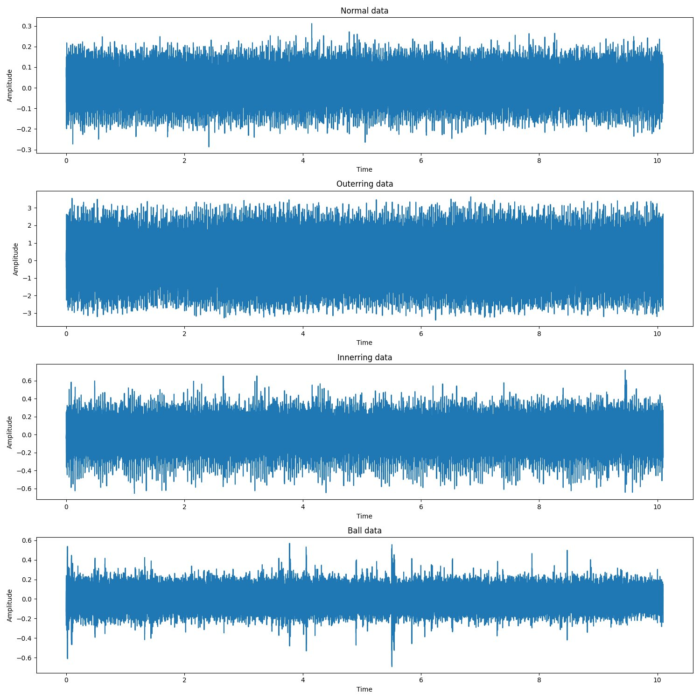
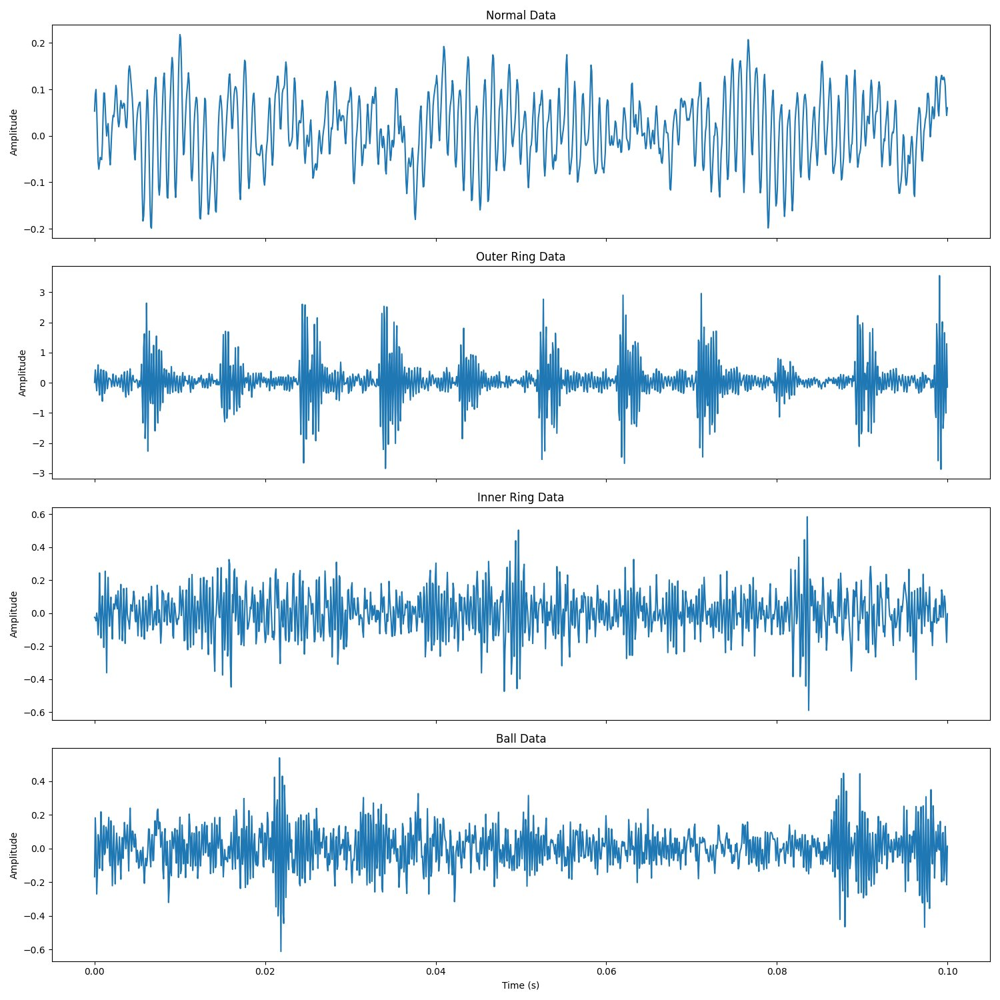
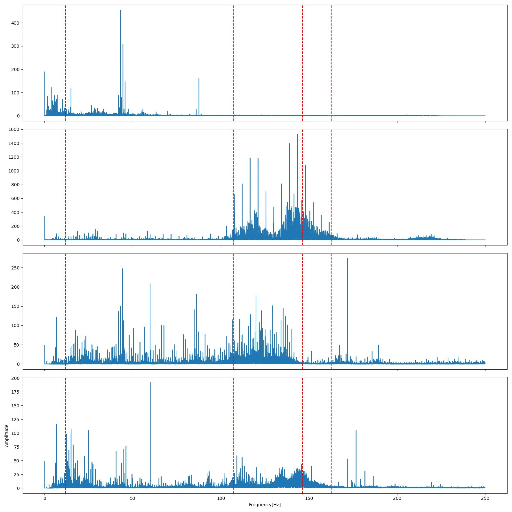
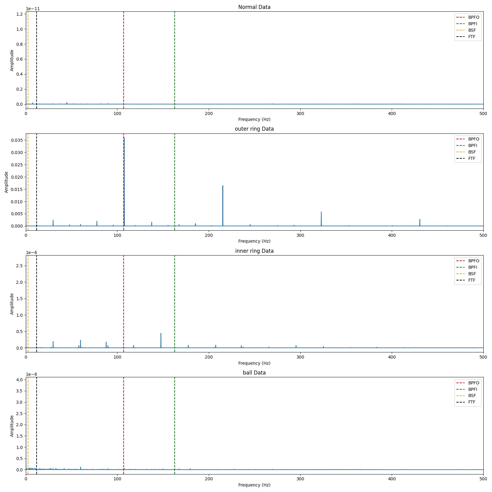
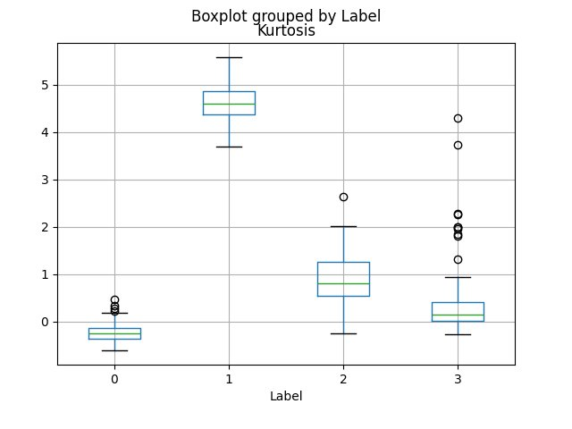
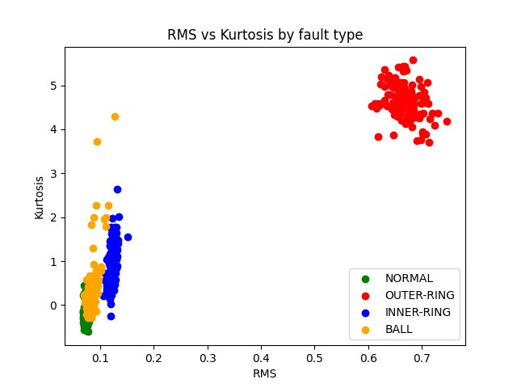
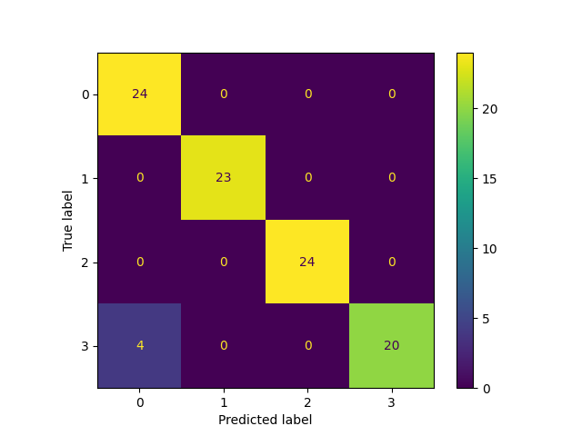
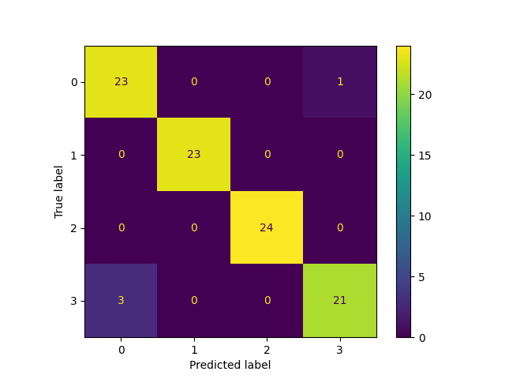
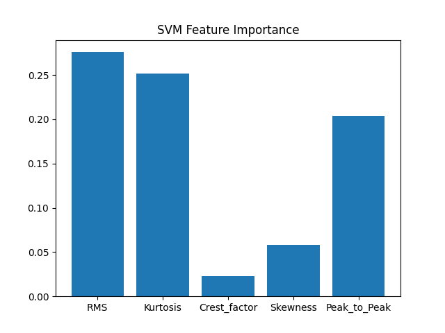

# Bearing Fault Detection — Signal Processing & Machine Learning

A self-initiated Masters project. Goal: take raw vibration signals from a bearing and automatically classify what type of fault it has — or if it's healthy.

**Dataset:** CWRU (Case Western Reserve University) Bearing Dataset — 12,000 Hz, 1797 RPM, 4 conditions:
`0 = Normal` | `1 = Outer Race` | `2 = Inner Race` | `3 = Ball fault`

---

## Month 1 — Signal Processing

### Raw Signals
<p align="left">


</p>

Outer ring signal has visibly higher amplitude. Zooming in shows periodic bursts — impacts of the ball hitting the damaged spot


---

### Characteristic Frequencies
Calculated from bearing geometry — these are the frequencies fault impacts repeat at:

| Frequency | Value | Meaning |
|---|---|---|
| BPFO | ~107 Hz | Ball pass frequency, outer race |
| BPFI | ~162 Hz | Ball pass frequency, inner race |
| BSF | — | Ball spin frequency |
| FTF | — | Fundamental train frequency |

<p align="center"></p>

---

### Hilbert Envelope Analysis
Pipeline: **Bandpass filter (3000–5000 Hz) → Hann window → Hilbert transform → DC removal → FFT**

<p align="center"></p>

- **Normal** — flat noise floor at BPFO. No fault.
- **Outer Ring** — sharp peak exactly at BPFO with harmonics at 2× and 3×. Textbook fault signature.
- **Inner Ring** — weak activity near BPFI. Harder to detect due to amplitude modulation.
- **Ball** — weakest signal. Ball faults are hardest to detect with envelope analysis.

---

### Feature Extraction
Each signal split into 1024-sample windows. 5 features computed per window:

| Feature | Why |
|---|---|
| RMS | Overall vibration energy |
| Kurtosis | Impulsiveness — faulty signals are spiky |
| Crest Factor | Peak/RMS ratio |
| Skewness | Signal asymmetry |
| Peak-to-Peak | Absolute vibration range |

**~470 windows × 5 features** saved to `bearing_features.csv`

<p align="left">
  
  
</p>

Outer ring cluster (Label 1) is completely separated in RMS vs Kurtosis space. Ball and Normal overlap — this becomes the main classification challenge.

---

## Month 2 — Machine Learning

### Data Preparation
- 80/20 stratified train/test split
- StandardScaler fitted on training data only — applied to both sets

---

### Random Forest vs SVM (RBF kernel)

**Confusion Matrices:**
<p align="left">
  
  
</p>

**Feature Importance:**
<p align="left">
  
  
</p>

Both models agree — RMS and Peak-to-Peak are the most important features. Crest Factor and Skewness contribute almost nothing.

---

### Results

| Model | Test Accuracy | CV Mean | CV Std |
|---|---|---|---|
| Random Forest | 95.8% | 94.7% | 3.0% |
| SVM RBF | 95.8% | 93.6% | 2.8% |

Both models achieve 95.8% on the test set. The only consistent mistake across both: **Ball fault misclassified as Normal** — visible in the scatter plot from Month 1 and confirmed by both confusion matrices.

**Winner: Random Forest** — higher cross validation mean, simpler to tune.

---

### Key Findings
- Outer Race fault is perfectly detectable with simple envelope analysis
- Ball fault is the hardest class — overlaps with Normal in feature space
- RMS and Peak-to-Peak drive classification — Crest Factor and Skewness are weak features
- Both models hit the same ceiling — improving accuracy requires better features, not better models

---

## Project Structure
```
self project/
├── src/
│   ├── Signalverarbeitung.py   # Signal processing pipeline
│   ├── data_prep.py            # Data loading, splitting, scaling
│   ├── learning_model.py       # Random Forest
│   └── svm_model.py            # SVM
├── figures/                    # All plots
├── Data/                       # .mat files (not uploaded)
└── bearing_features.csv        # Extracted features
```

## Libraries
`numpy` `scipy` `matplotlib` `pandas` `scikit-learn`

## Dataset
CWRU Bearing Data Center — https://engineering.case.edu/bearingdatacenter